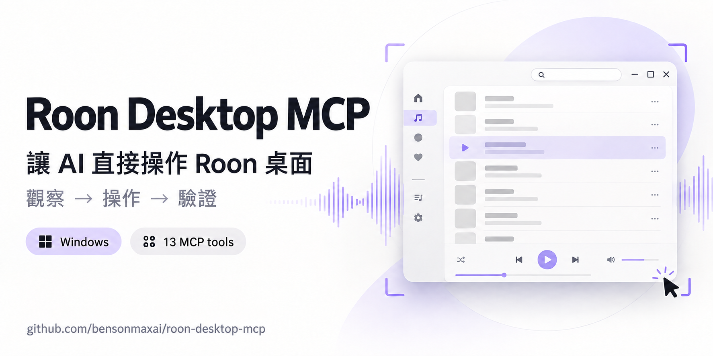

# Roon Desktop MCP

[](https://github.com/bensonmaxai/roon-desktop-mcp)

> **Observe. Act once. Verify.** A local, observed Roon Remote companion for trusted Windows MCP hosts.

**讓 AI 助手直接操作 Windows 上的 Roon，協助整理歌單、調整曲目順序與查看設定頁。**

Roon Desktop MCP 補上既有 Roon API 工具之外的桌面操作：先看目前畫面，定位目標，再點擊、輸入或拖曳，最後重新讀回結果。預設只開放觀察，桌面輸入需由本機操作者啟用。

Roon 的主畫面多為 canvas，Windows UIA 往往只看得到視窗框，OCR 與座標也只能協助定位。server 因此將資料或設定寫入的確認交給畫面讀回、完整 manifest 或既有 Roon API 的讀回，而不是把一次 click 的送達視為已保存。

## 可以交給 agent 的工作

- 「開啟 Roon，找出目前畫面上的搜尋欄，搜尋指定關鍵字，再確認結果區出現。」
- 「先讀取我的播放清單現況；在我確認後，建立一張測試歌單並核對曲目順序。」
- 「觀察 Queue、zone 與播放狀態，將可見資訊整理給我；不要改播放。」
- 「帶我到 DSP、MUSE 或 audio 設定頁，先讀回目前值，再等我決定是否修改。」
- 「背景操作沒有生效時，在我明確同意後把 Roon 視窗帶到前景，重新觀察再繼續。」

每個例子都從目前畫面出發。工具不會猜圖示位置，不會把一次 input receipt 當成寫入成功，也不會在結果不明時自行重送。

## 怎麼運作

```text
observe ──► 定位唯一目標 ──► act once ──► fresh observe / readback
   │                                  │                 │
   └──── frame、視窗與程序身分 ────────┴──── journal ────┴──► reconcile
```

1. `desktop_observe` 建立新的 Roon frame，含截圖、可取得的 UIA 與本機 Windows OCR。
2. `desktop_find` 或呼叫端在當前 frame 中鎖定目標；動作只可使用仍有效的 frame。
3. `desktop_act` 或 `desktop_navigate` 一次只執行一個 UI 動作，並以唯一 `operation_id` 留下 durable journal reservation。
4. 重新觀察或使用既有 Roon API 讀回 end state。`unknown`、`dispatched` 結果先由 `desktop_reconcile` 結案，不重播輸入。

這個流程把「畫面有變」和「資料確實已保存」分開處理，方便 agent 和人一起判斷下一步。

## 13 個 MCP 工具

| 工具 | 用途 |
| --- | --- |
| `desktop_status` | 查看 Roon Remote process、視窗與 driver binding；不啟動 app。 |
| `desktop_open` | 視需要啟動既有 Roon Remote，並取得觀察。 |
| `desktop_activate` | 在明確授權下把當前 Roon 視窗帶到前景，供 recovery 使用。 |
| `desktop_observe` | 取得新的 frame、PNG、UIA、OCR 與視窗身分。 |
| `desktop_find` | 在目前 frame 的可見 OCR/UIA 文字中找目標。 |
| `desktop_act` | 對最新 frame 做一次 click、type、key、scroll、drag 或選取動作。 |
| `desktop_navigation_routes` | 列出可用路由、快捷鍵與可見標籤別名。 |
| `desktop_navigate` | 用於前往可見 Roon 區域或設定頁；會送出 UI input，需先在本機啟用 input，呼叫端提供的 target 仍是 generic click，必須核對真正目標與語意。 |
| `desktop_verify` | 以新 frame 檢查可見文字；不把 OCR 當作資料寫入證明。 |
| `desktop_operation` | 讀取持久化的操作狀態與未決結果。 |
| `desktop_reconcile` | 記錄呼叫端已驗證的 end state；不會重送 UI input。 |
| `desktop_workflows` | 列出完整的引導工作流程。 |
| `desktop_workflow` | 讀取單一 workflow 的前提、提交點、驗證和復原方式。 |

## 功能矩陣：可做什麼、目前證據到哪裡

| 能力 | 目前提供 | 證據與限制 |
| --- | --- | --- |
| 觀察 Roon 桌面 | 視窗選取、frame、PNG、可用的 UIA/OCR | 每次觀察是瞬時畫面；OCR 不完整或錯字時必須重新定位。 |
| 導航與可見搜尋 | 路由、快捷鍵、一次性已觀察動作 | 會送出桌面 input，預設拒絕；啟用後仍只能確認新畫面或可見結果區，不能推論完整 library 查詢結果。 |
| 播放清單、library、Queue、tag | 35 條可讀取的 workflow recipe | 全數為 `guided_unverified`、`agent_assisted`，不是一鍵語意 API。 |
| audio、DSP、MUSE | 導航、單步 UI primitive 與驗證框架 | 實際設定值與播放結果必須逐次讀回。 |
| foreground recovery | 受 guard 的 `desktop_activate` 與一次性 foreground retry | 預設關閉；需要明確使用者同意和已證實的 background refusal/no-op。 |
| 操作復原 | durable operation journal、reconcile 與 replay guard | journal 不保存 typed text、截圖、token 或帳號資料。 |

35 條流程全部標示為 `guided_unverified`，這是刻意的支援級別。它表示 agent 能取得前提、提交界線、驗證證據與復原步驟；每次真正寫入仍要依目前 Roon build、畫面和使用者授權完成驗證。完整清單見 [workflow guide](docs/workflows.md)。

## 安裝前準備

| 元件 | 需求 |
| --- | --- |
| 作業系統 | Windows。 |
| Node.js / npm | Node.js 22 以上，npm 與同一安裝來源。 |
| Roon | 已安裝 Roon Remote 的 `Roon.exe`；不是 RoonServer。開發驗證目標為 Roon Remote 2.71.1683。 |
| CUA driver | 另行安裝且可執行的 `cua-driver.exe`。本專案測過已安裝的 [CUA driver public source/interface](https://github.com/trycua/cua/tree/main/libs/cua-driver/rust) 0.8.3；binary 不隨 repo 附帶，也不由腳本下載。 |
| OCR 語言包 | 建議安裝繁中與英文 Windows OCR 語言包；缺少時仍可取得截圖，但文字定位能力下降。 |

建議把 dependencies、runtime、captures 和 operation journal 放在不會同步或共用的本機資料夾。`setup.ps1`／`launch.ps1` 實際只拒絕 `DependenciesDir` 與 `RuntimeDir` 路徑文字中含有 `OneDrive` 的目的地；它不會辨識所有同步服務、repo 位置、junction 或其他 reparse point。

## 快速開始

```powershell
git clone https://github.com/bensonmaxai/roon-desktop-mcp.git
Set-Location .\roon-desktop-mcp

$deps = '<outside-repository-dependencies-dir>'
$runtime = '<outside-repository-runtime-dir>'
$driver = '<absolute-path-to-cua-driver.exe>'
$roon = '<absolute-path-to-Roon.exe>'

.\scripts\setup.ps1 `
  -DependenciesDir $deps `
  -RuntimeDir $runtime `
  -DriverPath $driver `
  -RoonPath $roon
```

`setup.ps1` 支援內建 Windows PowerShell 5.1，會檢查 Node 版本、lockfile 與已安裝 dependency versions。若依賴已存在、只想做本機前置檢查，可加 `-SkipInstall`。

以手動 stdio 模式啟動：

```powershell
.\scripts\launch.ps1 `
  -DependenciesDir $deps `
  -RuntimeDir $runtime `
  -DriverPath $driver `
  -RoonPath $roon
```

啟動器預設 `ROON_DESKTOP_ALLOW_INPUT=0` 與 `ROON_DESKTOP_ALLOW_FOREGROUND=0`。因此 `desktop_act` 和 `desktop_navigate` 都會被拒絕；只有受信任的本機操作者明確以 `-AllowInput 1` 啟動後才可送出任何桌面 input。`desktop_activate` 另須 `-AllowForeground 1` 與呼叫端宣告的使用者同意。啟動器不會註冊全域 MCP、建立常駐服務或啟動 CUA daemon。完整安裝、host 設定範本與 smoke check 在 [setup guide](docs/setup.md)。

## 部署與資料流

這是給受信任本機 MCP host 的 stdio server；它沒有 HTTP endpoint、listener 或多使用者隔離。Windows OCR 在本機執行，但每個 observation 的 PNG、OCR 文字與 UIA 資訊會回傳給 MCP client。若 host 或 client 使用雲端服務，這些畫面與文字可能隨之離開本機，請只在可接受該資料流的環境使用。

## 驗證與支援狀態

本 repository 的 **2026-09-10 / 0.1.0 開發建置**有 77/77 個自動測試通過，並做過 31 個 JavaScript modules 的 syntax check。這是特定 build 的 regression evidence，不是對所有 Roon 版本、DPI、螢幕、Queue 內容或 DSP 路徑的相容性承諾。

另有一個隔離、可丟棄的播放清單 CRUD 情境做過人工 end-state 驗收：建立、加入、重新排序、改名、移除及刪除，都以獨立觀察讀回。它不會把其餘 35 條 recipe、既有播放清單、完整 Queue manifest、audio 或 DSP 寫入宣告為已驗證。詳細範圍見 [verification](docs/verification.md) 與可重用的 [local acceptance plan](docs/acceptance-plan.md)。

## 操作與安全界線

- 預設不送任何桌面 input；`desktop_act` 與 `desktop_navigate` 都必須先以 `ROON_DESKTOP_ALLOW_INPUT=1` 作本機 opt-in。導航不是天生 readonly。
- 所有音樂資料、Queue、playback、audio 與 DSP 寫入都要先有使用者對**確切範圍**的授權；相同 scope 內的非破壞性步驟可沿用既有授權，remove、delete、clear、reset 仍要在動作當下確認目標。
- `user_authorized`、`intent` 與 `desktop_reconcile` evidence 都是呼叫端 assertion，屬於 assistant guardrail，不是用來防禦惡意 MCP client 的 security sandbox。canvas 的 raw pixel、`Return` 或 context menu 也可能讓工具無法完整理解動作語意。
- 帳號、登入、密碼、授權與權限 UI 由使用者手動處理，不在 workflow 範圍。
- foreground 會短暫把焦點帶到 Roon。`desktop_activate` 需要獨立的 foreground opt-in 與使用者同意；foreground input 另須 input opt-in、先前 background refusal 或 caller 已驗證的 no-op，以及同一 action 的一次性 permit。

詳見 [操作模型與復原方式](docs/operation-model.md) 與 [security guidance](SECURITY.md)。
