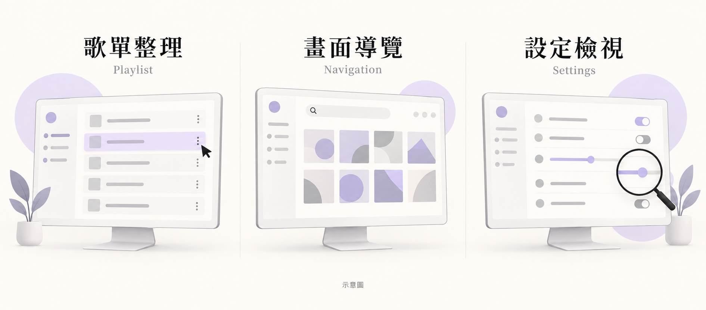
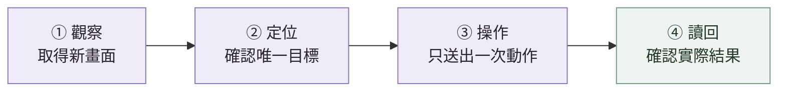

# Roon Desktop MCP

<p align="center">
  
</p>

<p align="center"><strong>讓 AI 看懂當前畫面，協助你操作 Windows 上的 Roon。</strong><br>Observe. Act once. Verify.</p>

<p align="center">
  <a href="#可以怎麼用">使用情境</a> ·
  <a href="#每一步都有畫面與結果可查">操作流程</a> ·
  <a href="#快速開始">快速開始</a> ·
  <a href="docs/setup.md">完整安裝文件</a>
</p>

| 13 個 MCP 工具 | 35 條引導流程 | Windows 桌面 | 預設觀察模式 |
| :---: | :---: | :---: | :---: |
| 看畫面、定位、操作、讀回 | 歌單、Queue、library、設定 | 對接已安裝的 Roon Remote | 本機啟用後才可點擊與輸入 |

Roon Desktop MCP 把 **Roon 桌面操作接進 AI 助手的工作流程**。你可以用自然語言交代任務，讓支援 MCP 的助手讀取畫面、找到目標，協助搜尋、整理歌單或檢視設定，再重新讀回結果。

它補上既有 Roon API 工具之外的桌面操作，透過本機 stdio 連接受信任的 MCP host。**預設只開放觀察；要送出桌面輸入，需由本機操作者明確啟用。**

## 可以怎麼用



*情境示意圖；介面為概念插畫，實際操作以當前 Roon 畫面為準。*

<table>
<tr>
<td width="33%" valign="top">
<h3>歌單整理</h3>
<p>協助建立、加入曲目、調整順序與改名，每次操作後重新讀回。</p>
<blockquote>「建立一張測試歌單，加入我指定的曲目，再核對順序。」</blockquote>
</td>
<td width="33%" valign="top">
<h3>畫面導覽</h3>
<p>搜尋可見內容、切換頁面，或整理目前畫面上的 Queue 與播放資訊。</p>
<blockquote>「搜尋我指定的關鍵字，確認結果區出現，再整理可見資訊。」</blockquote>
</td>
<td width="33%" valign="top">
<h3>設定檢視</h3>
<p>帶你到 audio、DSP 或 MUSE 頁面，先查看目前值，再決定下一步。</p>
<blockquote>「打開 MUSE，讀出畫面上的設定值，先不要修改。」</blockquote>
</td>
</tr>
</table>

這些任務由 agent 依照畫面逐步操作。35 條流程目前都是 **`guided_unverified` / `agent_assisted`**，提供前提、操作與驗證指引；每次實際寫入仍需確認授權與結果。[查看全部流程 →](docs/workflows.md)

## 每一步都有畫面與結果可查



**結果不明時，重新觀察與核對，不重播輸入；確認後再記錄結果。**

1. **觀察：** `desktop_observe` 取得截圖、可用的 UIA、Windows OCR 與視窗身分。
2. **定位：** `desktop_find` 或 agent 在仍有效的 frame 中確認目標。
3. **操作：** `desktop_act` / `desktop_navigate` 執行單一動作，以 `operation_id` 記錄狀態。
4. **讀回：** 重新觀察，必要時搭配完整 manifest 或既有 Roon API 讀回；`desktop_reconcile` 記錄呼叫端提供的結果證據，不自行做語意驗證。

Roon 主畫面多為 canvas，UIA 與 OCR 不一定能取得完整內容。因此工具會檢查 frame 與視窗身分，避免沿用失效位置；**一次點擊送達，還需要結果讀回才能判斷工作是否完成。**

歌單、Queue 或 DSP 的保存結果，需要完整清單、設定值或既有 Roon API 的讀回；單靠畫面變化或 OCR 無法證明已保存。

## 目前驗證到哪裡

| 驗證項目 | 已有證據 | 適用範圍 |
| --- | --- | --- |
| 自動測試 | **77 / 77 通過** | 2026-09-10 / 0.1.0 開發建置。 |
| 語法檢查 | **31 個 JavaScript modules 通過** | `src`、`scripts`、`tests`。 |
| MCP 連接 | **13 個工具、35 條流程可讀取** | stdio 初始化與不送 UI input 的 smoke check。 |
| 測試歌單 | **6 個階段完成受限人工驗收** | 單一、隔離、可丟棄的播放清單；每階段獨立讀回。 |

**測試歌單的驗收順序**


上述驗收限於該測試情境。**既有歌單、完整 Queue，以及 audio / DSP / MUSE 設定寫入仍需另行驗證**；也尚未建立跨 Roon 版本、DPI 或螢幕配置的相容性承諾。[完整驗證範圍 →](docs/verification.md)

## 快速開始

### 1. 準備環境

| 必要元件 | 需求 |
| --- | --- |
| Windows + Roon Remote | 已安裝 `Roon.exe`；開發驗證目標為 Roon Remote 2.71.1683。 |
| Node.js / npm | Node.js **22 以上**，npm 與同一安裝來源。 |
| CUA driver | 自行準備可執行的 `cua-driver.exe`；測過 [public source / interface](https://github.com/trycua/cua/tree/main/libs/cua-driver/rust) 0.8.3，repo 不附 binary 或自動下載。 |
| Windows OCR | 建議安裝繁中與英文語言包；缺少時仍可截圖，文字定位能力會下降。 |

### 2. 安裝本機依賴

```powershell
git clone https://github.com/bensonmaxai/roon-desktop-mcp.git
Set-Location .\roon-desktop-mcp

$localRoot = Join-Path $env:LOCALAPPDATA 'RoonDesktopMCP'
$deps = Join-Path $localRoot 'dependencies'
$runtime = Join-Path $localRoot 'runtime'
$driver = '<absolute-path-to-cua-driver.exe>'
$roon = '<absolute-path-to-Roon.exe>'

.\scripts\setup.ps1 `
  -DependenciesDir $deps `
  -RuntimeDir $runtime `
  -DriverPath $driver `
  -RoonPath $roon
```

先將 `$driver` 與 `$roon` 換成你的實際執行檔位置。腳本支援 Windows PowerShell 5.1；已有依賴、只做前置檢查時可加 `-SkipInstall`。

### 3. 連接 MCP host

依 [完整安裝文件與 MCP 設定範本](docs/setup.md) 填入本機路徑。若要手動啟動 stdio server：

```powershell
.\scripts\launch.ps1 `
  -DependenciesDir $deps `
  -RuntimeDir $runtime `
  -DriverPath $driver `
  -RoonPath $roon
```

| 你要的模式 | 啟動設定 | 行為 |
| --- | --- | --- |
| **先看畫面** | 預設值 | 可觀察與讀取狀態；拒絕點擊、輸入與導航動作。 |
| **允許桌面操作** | 加上 `-AllowInput 1` | 受信任的 agent 可在授權範圍內送出 UI input。 |
| **允許前景復原** | 另加 `-AllowForeground 1` | 經使用者同意，可將 Roon 帶到前景；前景輸入另有重試條件。 |

啟動器預設 `ROON_DESKTOP_ALLOW_INPUT=0`、`ROON_DESKTOP_ALLOW_FOREGROUND=0`，不會註冊全域 MCP、建立常駐服務或啟動 CUA daemon。安裝後可先讓 agent **「查看 Roon 目前畫面，不送出桌面操作」**。

<details>
<summary><strong>展開：13 個 MCP 工具</strong></summary>

| 工具 | 用途 |
| --- | --- |
| `desktop_status` | 查看 process、視窗與 driver binding；不啟動 app。 |
| `desktop_open` | 視需要啟動既有 Roon Remote，並取得觀察。 |
| `desktop_activate` | 在獨立 foreground opt-in 與明確同意下，把 Roon 帶到前景。 |
| `desktop_observe` | 取得新 frame、PNG、UIA、OCR 與視窗身分。 |
| `desktop_find` | 在目前 frame 的可見 OCR / UIA 文字中找目標。 |
| `desktop_act` | 對有效 frame 做一次 click、type、key、scroll、drag 或選取動作。 |
| `desktop_navigation_routes` | 列出路由、快捷鍵與可見標籤別名。 |
| `desktop_navigate` | 以 UI input 前往可見區域或設定頁；須啟用 input，並核對實際目標。 |
| `desktop_verify` | 以新 frame 檢查可見文字；OCR 本身不證明資料已寫入。 |
| `desktop_operation` | 讀取持久化的操作狀態與未決結果。 |
| `desktop_reconcile` | 記錄呼叫端提供的結果證據；不獨立驗證語意，也不重送 UI input。 |
| `desktop_workflows` | 列出引導工作流程。 |
| `desktop_workflow` | 讀取單一流程的前提、提交點、驗證與復原方式。 |

</details>

## 操作與資料界線

這是給**受信任本機 MCP host** 使用的 stdio server，沒有 HTTP endpoint、network listener 或多使用者隔離。Windows OCR 在本機執行；截圖、OCR 與 UIA 資訊會回傳給 MCP client，若 client 使用雲端服務，這些內容也可能隨之離開本機。

音樂資料、Queue、playback、audio 與 DSP 寫入需有使用者對確切範圍的授權。相同 scope 內的非破壞性步驟可沿用既有授權；移除、刪除、清空、重設則要在動作當下確認目標。帳號、登入、密碼、授權與權限 UI 由使用者手動處理。

<details>
<summary><strong>展開：授權、前景復原與本機保存規則</strong></summary>

- `user_authorized`、`intent` 與 reconcile evidence 都是呼叫端宣告，屬於 assistant guardrail，無法隔離惡意 MCP client。raw pixel、`Return` 或 context menu 的語意，也可能無法由工具完整判斷。
- 導航會送出 UI input，須先啟用 `ROON_DESKTOP_ALLOW_INPUT=1`；呼叫端提供的 target 仍是 generic click，必須確認實際動作。
- `desktop_activate` 需要獨立 foreground opt-in 與使用者同意。foreground input 另須 input opt-in、先前 background refusal 或 caller 已驗證的 no-op，以及同一 action 的一次性 permit；帶到前景會改變視窗焦點。
- Journal 預設上限 **10,000 筆**，每筆最多 **64 KiB**；滿額時拒絕新的 operation ID，保留既有紀錄。`operation_id` 會原樣保存，請使用隨機、非識別性 ID。
- Server captures 最多保留 80 張；client-captures 副本沒有自動上限。不要把 captures、journal 或私人音樂資料提交到公開 repository。
- Dependencies、runtime 與 captures 應放在不會同步或共用的本機資料夾。腳本只檢查 dependencies / runtime 路徑文字是否含 `OneDrive`，無法辨識所有同步服務、junction 或 reparse point。

</details>

## 延伸閱讀

| 文件 | 內容 |
| --- | --- |
| [安裝與 MCP host 設定](docs/setup.md) | 路徑、環境變數、啟動與 smoke check。 |
| [35 條引導流程](docs/workflows.md) | 各任務的前提、操作界線與驗證方式。 |
| [操作模型與復原](docs/operation-model.md) | frame、journal、重送防護與 reconcile。 |
| [驗證紀錄](docs/verification.md) · [本機驗收計畫](docs/acceptance-plan.md) | 已完成的證據，以及新環境如何重跑。 |
| [Security](SECURITY.md) | 本機信任界線、資料保存與回報方式。 |

---

*本專案為獨立開發的 Roon 桌面操作工具，與 Roon 官方無隸屬或背書關係。*
